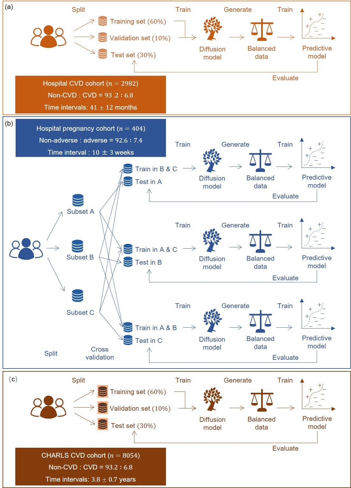

# DiffGlycemia


# Workflow



## 🔧 Prepare Conda Environment

```bash
git clone https://github.com/enai4bio/DiffGlycemia.git

conda env create -f environment.yml
```

## 🧠 Training for CVD Events (on the CHARLS data)

```bash
conda activate diff_glycemia

rm -rf exp/*

cp config_bak/cvd_CHARLS/config.toml exp/config.toml

python scripts/tune_ddpm.py --wd . --job train_sample_eval

## 🧠 Training for CVD Events (on the hospital's syntherics data)

```bash
conda activate diff_glycemia

rm -rf exp/*

cp config_bak/cvds/config.toml exp/config.toml

python scripts/tune_ddpm.py --wd . --job train_sample_eval
```

## 🤰 Training for Adverse Pregnancy Outcomes (on the hospital's syntherics data)

```bash
conda activate diff_glymecia

rm -rf exp/*

cp config_bak/preg/config.toml exp/config.toml

python scripts/tune_ddpm.py --wd . --job train_sample_eval
```

## 🧪 Synthetic data

```bash
cd data_synthetic
```

## 📊 Training data

```bash
cd data_training
```

**Note**: To preserve participant privacy, we provide synthetic data that can be used to re-run the code. Therefore, DiffGlycemia/data_training is sampled from DiffGlycemia/data_synthetic, preserving the original proportion between majority and minority classes. The dataset is then split into training, validation, and test subsets. 


