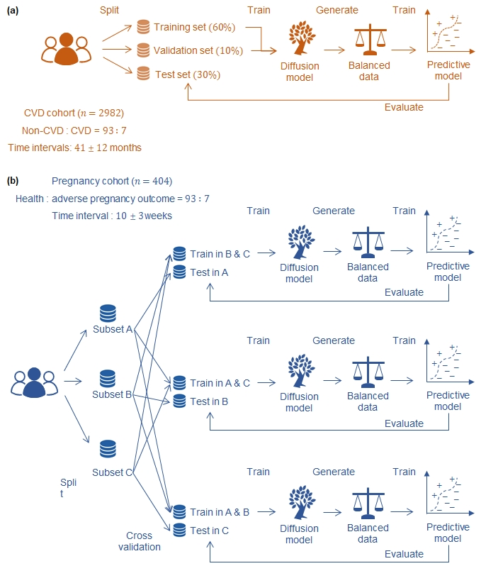

# DiffGlycemia




## 🔧 Prepare Conda Environment

```bash
git clone https://github.com/enai4bio/DiffGlycemia.git

cd DiffGlycemia

conda env create -f environment.yml
```

## 🧠 Run Training for CVD Events

```bash
conda activate diff_glycemia

cd DiffGlycemia

rm -rf exp/*

cp config_bak/cvds/config.toml exp/config.toml

python scripts/tune_ddpm.py --wd . --job train_sample_eval
```

## 🤰Run Training for Adverse Pregnancy Outcomes

```bash
conda activate diff_glymecia

cd DiffGlycemia

rm -rf exp/*

cp config_bak/preg/config.toml exp/config.toml

python scripts/tune_ddpm.py --wd . --job train_sample_eval
```

## 🧪 Synthetic data

```bash
cd DiffGlycemia/data_synthetic
```

## 📊 Training data

```bash
cd DiffGlycemia/data_training
```

**Note**: DiffGlycemia/data_training is sampled from DiffGlycemia/data_synthetic, preserving the original proportion between majority and minority classes. The dataset is then split into training, validation, and test subsets. To preserve participant privacy, we provide synthetic data that can be used to re-run the code.